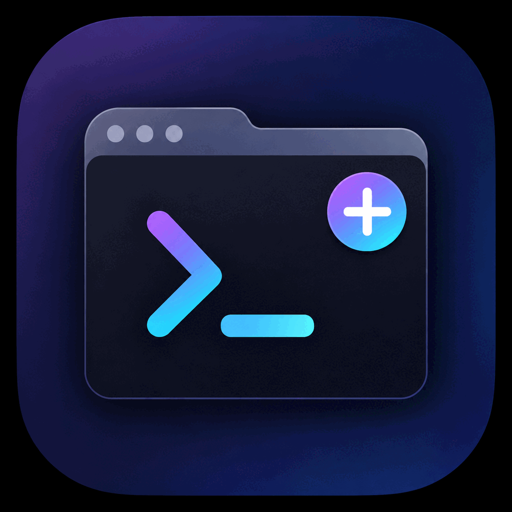
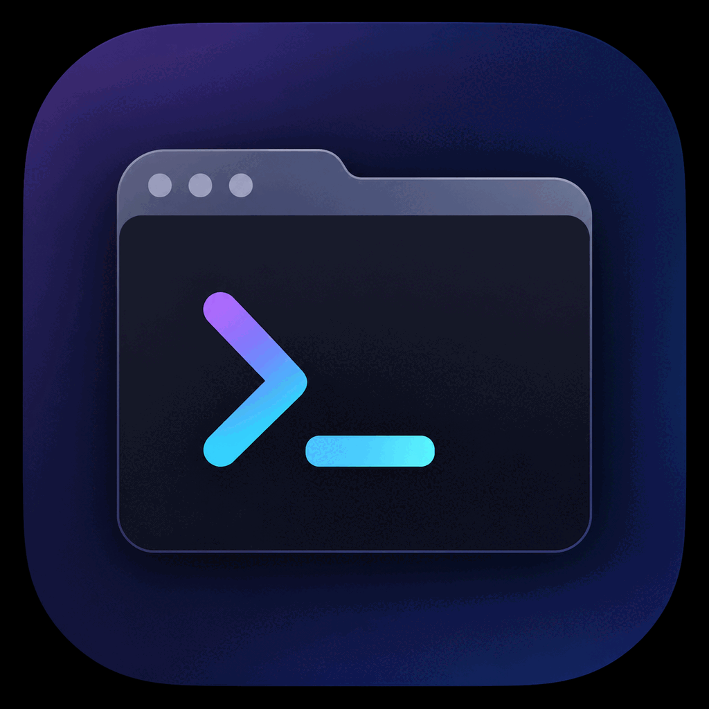
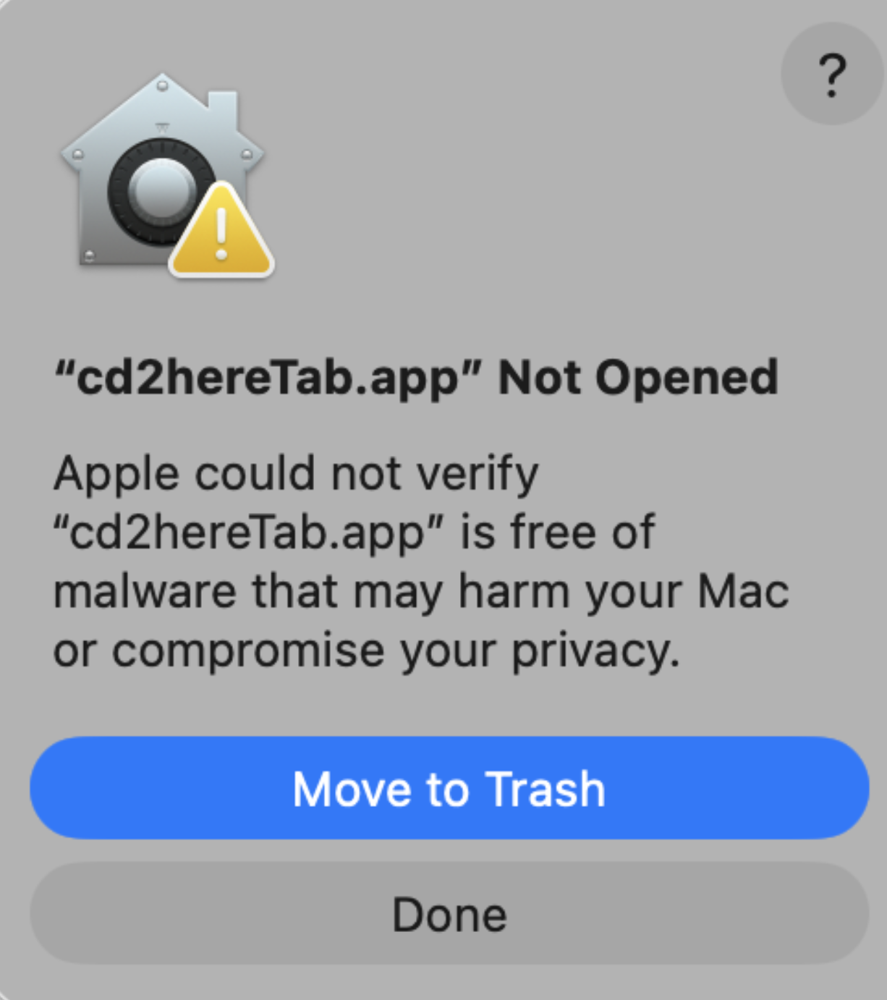
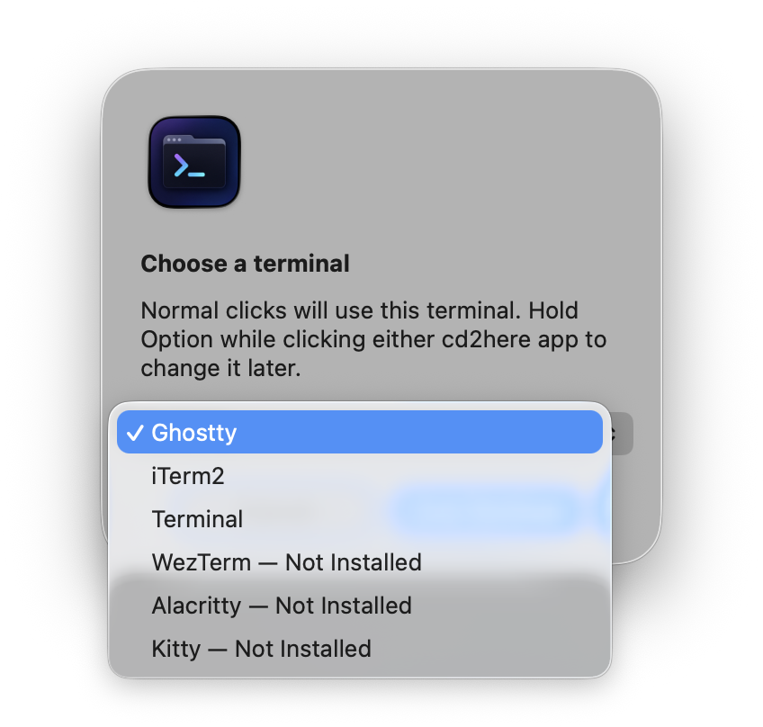

# cd2here

> 把 Finder 里正在浏览的目录，一键送到终端里。

<p>
  
  &nbsp;&nbsp;
  
</p>

[English](README.md) | **简体中文**

cd2here 是两个可以放进 Finder 工具栏的小型 macOS 应用。它们先向 Finder 询问当前所在位置，再让用户选择的终端把它作为工作目录打开。

- **`cd2hereWindow.app`**：始终在选定终端中新建窗口。
- **`cd2hereTab.app`**：在选定终端的前台窗口中新建标签页；终端还没有窗口时，退化为新建窗口。

两个应用都是 `LSUIElement` —— 没有 Dock 图标、不出现在 ⌘Tab 应用切换器里、没有菜单栏图标、没有偏好设置窗口。启动、做一件事、退出，仅此而已。

## 安装

### Homebrew（推荐）

```sh
brew install --cask cd2here
```

然后按下面的步骤，把 `cd2hereWindow.app` 与 `cd2hereTab.app` 拖进 Finder 工具栏。

### 下载预编译包

1. 从 [v0.4 发布页](https://github.com/ActivationEnergy/cd2here/releases/tag/v0.4) 下载 `cd2here-v0.4-darwin-universal.zip`。
2. 解压。
3. 把 `cd2hereWindow.app` 和 `cd2hereTab.app` 拖到 `/Applications`。

预编译包是 ad-hoc 未签名构建——首次启动会被 Gatekeeper 拦截。**新版 macOS 的对话框只有"移到废纸篓"和"完成"两个按钮**（没有"打开"选项），所以唯一可走的路径是经由系统设置：

1. 点 **完成 (Done)** 关掉对话框。
2. 打开 **系统设置 → 隐私与安全性**，滚到页面底部。
3. 在 "`cd2hereWindow.app`（或 `cd2hereTab.app`）已被阻止…"那一行右侧点 **仍要打开 (Open Anyway)**。
4. macOS 再问一次确认；点 **打开 (Open)**。

这次一次性批准之后，再双击 app（或在工具栏里点）就不会再触发 Gatekeeper 对话框了。

### 从源码构建

参见下方的 [从源码构建](#从源码构建)。

## 使用

### 把 app 加入 Finder 工具栏

cd2here 由两个小 AppKit app 组成 —— `cd2hereWindow.app`（始终开新窗口）和 `cd2hereTab.app`（开新标签页、没有窗口时退化为新窗口）。把每个从 `/Applications` 拖到任意 Finder 窗口的工具栏上即可。

如果 Finder 不接受拖拽，改用 **显示 → 自定工具栏**（或拖拽时按住 `⌘`）——这会进入工具栏定制模式。第一次 Gatekeeper 通过后直接拖拽一般是可行的。

### 第一次点击

首次点击工具栏图标时，macOS 会弹一个标题为 **"'cd2hereWindow.app' Not Opened"** 的 Gatekeeper 对话框，正文为 "Apple could not verify 'cd2hereWindow.app' is free of malware that may harm your Mac or compromise your privacy." 新版 macOS 的对话框通常**只有"移到废纸篓"和"完成"两个按钮**（没有"打开"选项），原因是二进制是 ad-hoc 未签名的——缺少 Developer ID 签名。



所以唯一可走的路径是经由系统设置：

1. 点 **完成 (Done)** 关掉对话框。
2. 打开 **系统设置 → 隐私与安全性**，滚到页面底部。
3. 在 "`cd2hereWindow.app`（或 `cd2hereTab.app`）已被阻止…"那一行右侧点 **仍要打开 (Open Anyway)**。
4. macOS 再问一次确认；点 **打开 (Open)**。

这次一次性批准之后，点击工具栏图标就放行——然后 macOS 会再弹一个**自动化权限**对话框，请 cd2here 控制 Finder 与你选的终端。前往 **系统设置 → 隐私与安全性 → 自动化** 授权。`cd2hereWindow` 和 `cd2hereTab` 因 Bundle ID 不同，会作为两个独立的权限目标分别出现，**两个都要授权**。

授权后，**首次**会出现终端选择框。选你想要的终端，两个 app 都记住这个选择。



### 后续点击

- 点 `cd2hereWindow` —— 在选定终端中**始终开新窗口**。
- 点 `cd2hereTab` —— 在选定终端的**前台窗口里开标签页**。
- 按住 **Option** 点击任意图标 —— 重新选择默认终端。

就是这样。选中的终端会以 Finder 当前目录作为初始工作目录启动。

## 支持的终端

| 终端 | 实现方式 |
| --- | --- |
| **Ghostty** | AppleScript 表面配置（`surface configuration`） |
| **iTerm2** | `cd <dir> && clear` 注入到 default profile session |
| **Terminal.app** | `do script "cd <dir> && clear"` |
| **WezTerm** | `wezterm start --always-new-process --cwd <path>`（窗口）/ `wezterm start --new-tab --cwd <path>`（标签） |
| **Alacritty** | `alacritty --working-directory <path>`（两种模式都开新窗口） |
| **Kitty** | `kitty --directory <path>`（窗口）/ `kitty @ launch --type tab --cwd <path>`（标签，需要 `allow_remote_control yes`） |

在真实机器上手工测试过：Ghostty、iTerm2、Terminal.app。仅由单元测试覆盖：WezTerm、Alacritty、Kitty。

## Finder 路径规则

cd2here 只向 Finder 询问一次，按下面的固定规则解析路径，再把结果交给终端。它**不会**枚举目录内容，也不会探测目录是否存在 —— 这是终端的工作。

| Finder state | 打开的目录 |
| --- | --- |
| 单选文件夹 | 该文件夹 |
| 单选文件 | 文件所在的父目录 |
| 没有选择 | Finder 前台窗口的当前目录 |
| 选择多个项目 | Finder 前台窗口的当前目录 |
| Finder 没有窗口 | `~/Desktop` |

## 终端行为

**Ghostty** 通过 AppleScript 的 surface configuration 接受初始工作目录。cd2here 在打开 surface 之前把它设好，所以 shell 会直接以正确的目录启动，不需要事后补命令。

**iTerm2 与 Terminal.app** 都没有提供"设置初始目录"的 AppleScript 属性。cd2here 因此用 Terminal.app 的 `do script`（或 iTerm2 的 `create window` / `create tab` + `write text`）以**默认 profile** 创建 session（不会覆盖 profile 里的命令，也不会替用户选择 shell），再向 session 写入经过 POSIX 单引号安全转义的 `cd <path>` 命令，紧随其后执行 `clear`。这会带来几个真实世界里需要知道的后果：

- iTerm2 的默认 profile（或 Terminal.app 的默认设置）应配置为启动本地交互式 shell。任何在启动阶段会弹窗的环节（钥匙串解锁、较慢的登录项等）都会推迟 `cd` 的执行时机。
- 屏幕会在切换目录后被清空，但 `cd` 这一行会保留在 shell history 中。这是故意的 —— 它保留了一条可追溯的审计线索。
- 路径里如果包含 shell 元字符，会先按 POSIX 单引号规则转义，再插入到脚本中。

对 Terminal.app 而言，`do script` 在 `tell application "Terminal"` 顶层表示"开新窗口并跑命令"，在 `tell front window` 内部则表示"在前台窗口里开新标签页并跑命令"。tab 模式在 Terminal.app 已经有窗口时复用前台窗口，没有窗口时退化到新开窗口。

**WezTerm、Alacritty 与 Kitty** 走各自原生的 CLI 而非 AppleScript（详细 argv 见上方"支持的终端"表）。

## 权限、云盘与外置目录

- **cd2here 自身**通常只需要 Finder 和所选终端的“自动化”权限。可前往 **系统设置 → 隐私与安全性 → 自动化** 授权。由于两个 App（`cd2hereWindow`、`cd2hereTab`）使用独立的 Bundle ID，macOS 对每个 App 分别询问授权——首次使用时会看到一组（App × 终端）的提示。
- **终端**才是进入并读取目录的应用。当路径位于桌面、文稿、下载、iCloud Drive、OneDrive 或其他 File Provider 域、网络卷或可移动存储设备时，macOS 可能要求为终端授予“文件与文件夹”权限。可前往 **系统设置 → 隐私与安全性 → 文件与文件夹** 完成授权。
- 外置卷在点击 cd2here 时必须处于挂载状态。如果 Finder 前台窗口目录无法解析（例如网络卷在 cd2here 读取时掉线），cd2here **会静默回退到 `~/Desktop`** 而不报错——终端窗口可能出现在意料之外的位置。卷恢复后再次点击即可。
- 仅存在于云端的内容可能被对应的云盘程序触发下载。这是云盘提供商的默认行为，与 cd2here 无关。

如果之前授予的自动化权限被拒绝，可在 **系统设置 → 隐私与安全性 → 自动化** 重新开启，再次点击工具栏应用即可。

## 系统要求

- macOS 13（Ventura）或更高版本 —— 同时支持 Apple Silicon 与 Intel Mac
- 至少安装以下终端之一：[Ghostty](https://ghostty.org)、[iTerm2](https://iterm2.com)、系统自带的 Terminal.app、[WezTerm](https://wezterm.org)、[Alacritty](https://alacritty.org) 或 [Kitty](https://sw.kovidgoyal.net/kitty/)。后三者既需要 `.app` bundle（例如通过 `brew install --cask …`），也需要对应的 CLI 二进制在 `PATH` 中。

## 架构

两个极小的 AppKit 入口（`cd2hereWindow/main.swift`、`cd2hereTab/main.swift`）都只调用 `AppRunner.run(mode:)`。其它逻辑全部位于 `Cd2HereCore` Swift package 中，并被两者共享：

| 文件 | 职责 |
| --- | --- |
| `AppRunner.swift` | 协调单次启动流程，驱动选择策略并对 spawn / AppleScript 失败显示 alert；CLI 非零退出仅 NSLog。 |
| `FinderContext.swift` | 通过 Apple Events 读取 Finder 状态，应用路径解析规则。 |
| `TerminalController.swift` | 终端身份、安装 / 兼容性检测、controller 分发、子协议（`AppleScriptTerminalControlling`、`CLITerminalControlling`）。 |
| `TerminalKindUI.swift` | UI 层对 `TerminalKind` 的扩展，解析 `option`（用 `NSWorkspace.urlForApplication` 与 option cache）。 |
| `GhosttyTerminalController.swift` | 以指定初始工作目录打开 Ghostty 窗口或标签页。 |
| `ITerm2TerminalController.swift` | 使用默认 profile 创建 iTerm2 session 并切换目录。 |
| `TerminalAppTerminalController.swift` | 通过 `do script` 打开 Terminal.app 窗口或标签页并切换目录。 |
| `WezTermTerminalController.swift` | 通过 `wezterm start` 创建 WezTerm 窗口（`--always-new-process`）或标签页（`--new-tab`）。 |
| `AlacrittyTerminalController.swift` | 通过 `alacritty --working-directory` 打开 Alacritty 窗口。 |
| `KittyTerminalController.swift` | 通过 `kitty --directory` 打开窗口；通过 `kitty @ launch` 开标签页（失败时退化为新窗口）。 |
| `CommandExecutor.swift` | 封装 `Process`。`run`（fire-and-forget）只在 spawn 失败时 throw，非零退出走 NSLog；`runAndWait` 是同步变体，用于快速探针（如 Kitty tab），把非零退出与 stderr 转成 `Cd2HereError.commandFailed`。 |
| `BinaryLocator.swift` | 为三个 CLI 终端解析绝对路径。 |
| `ShellLiteral.swift` | POSIX shell 单引号转义，被 iTerm2 与 Terminal.app 的 controller 共同使用。 |
| `TerminalPicker.swift` | 首次使用与 Option 点击时的选择对话框。 |
| `TerminalPreferences.swift` | 在 `UserDefaults` 中保存共享的默认终端。 |
| `AppleScriptExecutor.swift` | 在全局锁下编译并执行 AppleScript。 |
| `AppleScriptLiteral.swift` | AppleScript 字符串字面量转义。 |
| `Cd2HereError.swift` | 面向用户的错误类型。 |

新增一个终端需要碰 **3 个文件**：(1) 新建一个 controller 文件（遵循 `AppleScriptTerminalControlling` 或 `CLITerminalControlling`）；(2) 在 `TerminalController.swift` 里做 5 处小改动（`TerminalKind` 加 case + `displayName` + `bundleIdentifier` + `cliBinaryName` + `TerminalControllerFactory.make` 加 switch 分支）；(3) 在 `TerminalControllerTests.swift` 加测试。两个子协议扩展自动提供 `open` 与 `isCompatible` 默认实现。

## 从源码构建

```sh
git clone https://github.com/ActivationEnergy/cd2here.git
cd cd2here

# 运行核心单元测试
swift test

# （可选）修改 project.yml 后重新生成 cd2here.xcodeproj
xcodegen generate

# 在不签名的情况下构建两个 app（无需 Apple Developer 账号）
xcodebuild -project cd2here.xcodeproj -scheme cd2hereWindow -configuration Release CODE_SIGNING_ALLOWED=NO build
xcodebuild -project cd2here.xcodeproj -scheme cd2hereTab     -configuration Release CODE_SIGNING_ALLOWED=NO build
```

构建生成的 `.app` 默认落在 `~/Library/Developer/Xcode/DerivedData/` 下；放入工具栏前请先复制到 `/Applications`（或另一个稳定位置 —— 切勿放进会被 iCloud 同步的目录，那会让 Gatekeeper 失效）。

## 测试

### 已验证的 backend

下列终端由维护者在真实机器上**手工测试过**，覆盖了所有 Finder 状态（单选文件夹、单选文件、无选择、多选、Finder 无窗口）以及 `window` 与 `tab` 两种模式：

- **Ghostty**
- **iTerm2**
- **Terminal.app**

下列终端只通过了**单元测试**对 AppleScript / 命令行参数的语法校验，**未经手工实测**，因为维护者的机器上没有安装：

- WezTerm
- Alacritty
- Kitty

单元测试只能保证脚本或 argv *在语法层面合法*，不能保证：
- 二进制真的接受这些参数；
- Kitty 的 remote-control socket 实际可达；
- 被启动的终端会真的以 `--cwd` 给出的目录作为工作目录。

**欢迎提交针对未实测 backend 的 bug 报告**，会优先处理。如果你要新增一个 backend，请一并补上手工测试。

### 自动化测试

`swift test` 覆盖：

- 五 种 Finder 状态 → 解析目录分支。
- 桌面回退路径（AppleScript 中不依赖 `desktop folder as alias` 强制类型转换）。
- Finder 返回路径后卷变为不可用时的路径透传行为（Finder 是唯一权威来源）。
- Ghostty、iTerm2 与 Terminal.app 在 `window` 与 `tab` 两种模式下的 AppleScript 生成，包括没有终端窗口时的 tab fallback。
- WezTerm 的命令行参数构造（CLI-based；没有 AppleScript 需要编译）。
- 本地实际安装的 AppleScript backend 进行 AppleScript 编译校验。
- 对包含反斜杠、引号和换行的路径进行 POSIX shell 单引号转义校验。

端到端自动化需要登录状态下的 macOS GUI 会话与用户批准的 Apple Events 权限，相关场景在 [手动发布验收矩阵](PLAN.zh-CN.md#手动发布验收矩阵) 中以文档形式记录。

## 已知限制

- 仅支持 macOS。项目依赖 `NSAppleScript` 与 Info.plist 中的 `LSUIElement`。
- 目前支持 Ghostty、iTerm2、Terminal.app、WezTerm、Alacritty 与 Kitty。Warp 与 Hyper 暂未支持：它们的 AppleScript 接口都不允许第三方应用设置初始目录，唯一的折衷（键击模拟）需要 Accessibility 权限且不可靠。
- iTerm2 与 Terminal.app backend 都会向 session 写入 `cd`，因此这些应用的默认 profile / 默认设置会被一并继承。请确保它们启动的是本地交互式 shell。
- CLI 后端（WezTerm / Alacritty / Kitty）以 fire-and-forget 方式启动子进程。**非零退出仅通过 `NSLog` 记录，不会弹 alert** —— cd2here 在 spawn 返回后立即退出，没有 UI 表面承接错误。spawn 失败（ENOENT、EACCES、launchd 拒绝）**会**弹 alert。诊断日志可在 Console.app 过滤 `cd2here:`。
- Kitty 的 tab 模式需要 `kitty.conf` 中 `allow_remote_control yes`；缺失时点击 tab 工具栏会退化为开新窗口。探针是同步的（`runAndWait`），失败路径可靠。
- Alacritty 没有公开的 tab 创建 CLI/IPC，因此 `cd2hereTab.app` 在 Alacritty 下也会开新窗口。如不需要此行为，可使用 `cd2hereWindow.app`。
- 自动化权限是按 target 授予的：Finder 与所选终端需要分别授权；如果 macOS 重置了这些权限，再次点击时需要重新授予。由于 `cd2hereWindow` 与 `cd2hereTab` 使用独立的 Bundle ID，**每个 App 都是独立的权限目标**——授权了一个并不等于授权另一个。

## 许可证

MIT。详见 [LICENSE](LICENSE)。